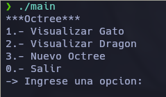
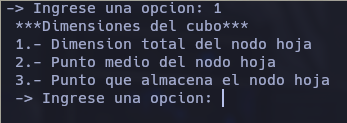
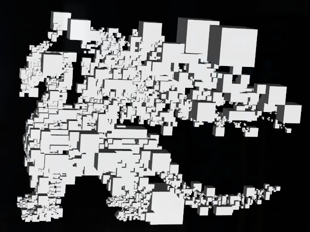
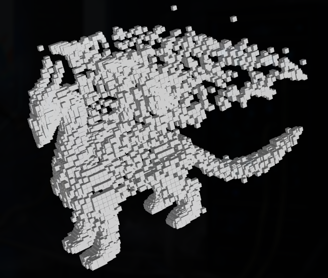
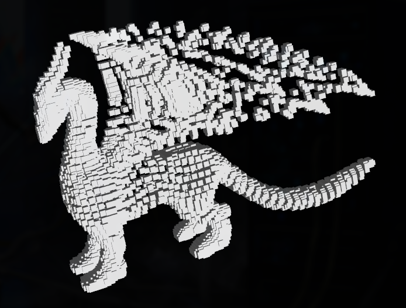
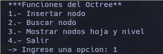
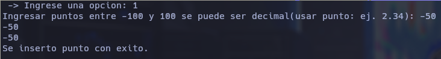
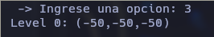
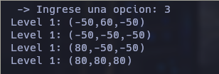
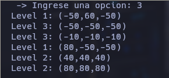

# IMPLEMENTACIÓN DEL OCTREE Y LA VISUALIZACIÓN DE FIGURAS TRIDIMENSIONALES
## Por: Paul Antony Parizaca Mozo

## Ejecución

Clonar el repositorio.
```bash
git clone https://github.com/PaulParizacaMozo/Octree
```
Crear el directorio build e ingresamos
```bash
mkdir build
cd build
```
Movemos los datasets *points1.csv* y *points2.csv* al directorio build
```bash
mv ../points1.csv ../points2.csv .
```
Ahora construimos el proyecto y ejecutable
```bash
cmake ..
make
./main
```

## Ejemplo de Ejecución

Primero cargara el menu inicial



En la primera y segunda opcion nos cargara en segundo menu



Y depende a cada opcion podemos visualizar las figuras

Con la Opcion 1 del menu de visualizacion



Con la Opcion 2 del menu de visualizacion



Con la Opcion 3 del menu de visualizacion



Con la tercera opcion nos cargara un menu de Octree con funciones como insertar,
buscar y mostrar nodos hojas junto a su nivel en el arbol



Insertamos un punto con la primera opcion



y podemos ver el nodo hoja con la tercera opcion



y asi podemos seguir insertando puntos(ej. en un nodo distinto de los hijos del
nodo root).
Es por ello que el arbol solo crece en 1 nivel



Pero si seguimos insertando, depende en como les asigne su posicion la funcion
de inserccion tendremos un arbol con distintos niveles.



La opcion de buscar nos pide las coordenadas de un punto y nos indica si 
se encuentra en el arbol.


